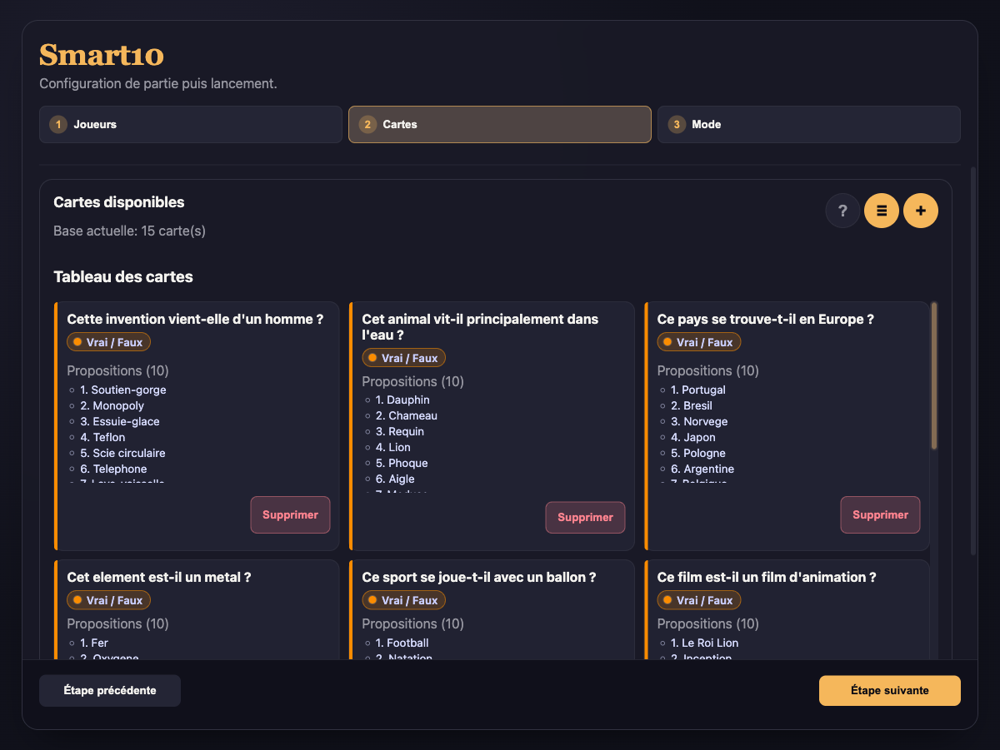
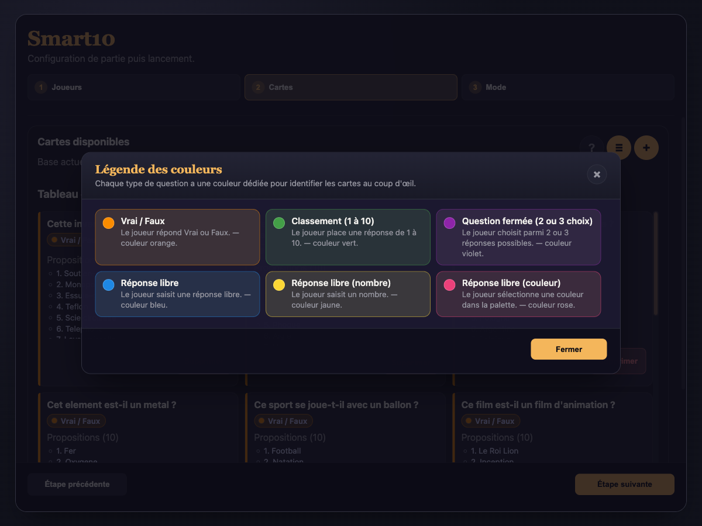
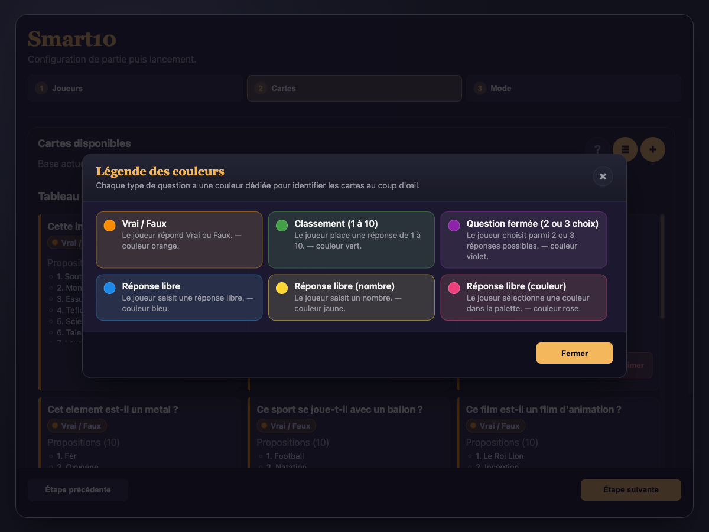

# Smart 10

Projet de formation Agile développé avec l'IA.

Smart 10 est une application desktop de quiz et de jeu de parcours inspirée du format « 10 propositions ».
Elle permet de créer des parcours, lancer des parties multi-joueurs, suivre les scores en direct et afficher un classement final.

## Captures d'écran

| Éditeur de cartes | Sélection du parcours |
|---|---|
|  |  |

| Sélection de type | Légende des types |
|---|---|
|  |  |

## Fonctionnalités

- **Création et édition de cartes** — titre, type de question, 10 propositions obligatoires.
- **6 types de questions** :
  - Vrai / Faux
  - Classement (1 à 10)
  - Question fermée (2 ou 3 choix)
  - Réponse libre (texte)
  - Réponse libre (nombre)
  - Réponse libre (couleur)
- **Légende visuelle des types** avec couleurs distinctes et descriptions.
- **2 modes de jeu** :
  - *Flash* — une seule carte, idéal pour une partie rapide.
  - *Parcours* — plusieurs cartes enchaînées avec objectif de points.
- **Gestion du parcours** — sélection, réordonnancement, sauvegarde locale des parcours.
- **Partie multi-joueurs** (1 à 10 joueurs) avec :
  - Timer d'ambiance configurable (15 s, 30 s ou 45 s).
  - Score temporaire + décision risque / capitalisation après chaque bonne réponse.
  - Feedback visuel immédiat (bonne/mauvaise réponse, verrouillage des propositions révélées).
  - Validation manuelle des réponses libres (texte).
- **Classement final** avec gestion des égalités.
- **Import / Export JSON** des cartes (ajout additif à l'import).
- **Persistance locale** des cartes et des parcours sauvegardés.

## Stack technique

- React 19 + TypeScript
- Zustand (état global)
- Vite (bundler)
- Electron (packaging desktop)
- Capacitor (packaging Android / APK)
- Vitest (tests unitaires)

## Démarrage rapide

Prérequis : **Node.js 20+** et npm.
Pour le build APK Android, il faut aussi **Java** et l'outillage Android (Android Studio / SDK).

```bash
npm install
npm run dev        # Lance Vite + Electron en mode développement
```

Build et packaging :

```bash
npm run build      # Compile le renderer et le process Electron
npm run dist       # Génère l'installeur (dmg / exe / AppImage)
npm run build:apk  # Génère l'APK Android via Capacitor
npm run build:all  # Lance les deux chaînes de build
```

Le renderer React est partagé par les deux cibles. Le build web alimente à la fois Electron et Capacitor, donc les changements UI / logique restent uniques.

Tests :

```bash
npm test           # Vitest (run once)
npm run test:watch # Vitest en mode watch
```

## Documentation

| Document | Contenu |
|---|---|
| [docs/GAME_RULES.md](docs/GAME_RULES.md) | Règles fonctionnelles complètes |
| [docs/QUESTION_AUTHORING.md](docs/QUESTION_AUTHORING.md) | Création et édition de cartes |
| [docs/INSTALL.md](docs/INSTALL.md) | Guide d'installation joueurs et développeurs |
| [docs/TECHNICAL_DESIGN.md](docs/TECHNICAL_DESIGN.md) | Architecture et conception technique |
| [docs/TEST_PLAN.md](docs/TEST_PLAN.md) | Plan de tests |
| [docs/PROJECT_OVERVIEW.md](docs/PROJECT_OVERVIEW.md) | Vue projet complète (contexte Agile) |
